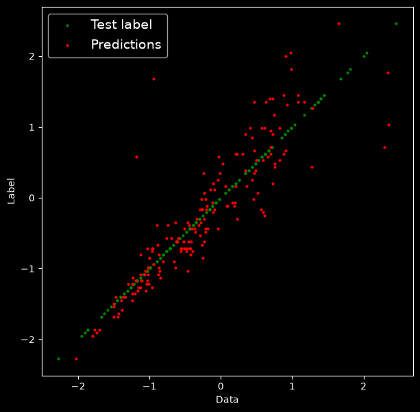
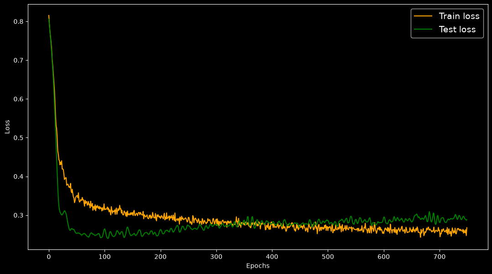

Machine Learning project using PyTorch for food delivery time predicting

The main Framework used in this project is "PyTorh" and the most important libraries is numpy, pandas, sklearn, matplotlib, seaborn

The project's structure is:

linearregressionML/

├─ configs/

│  └─ config.json

├─ data/

│  ├─ data.csv

│  └─ row_data.csv

├─ models/

│  └─ DeliveryModelV0.pth

├─ notebooks/

│  └─ notebook.ipynb

├─ src/

│  ├─ config.py

│  ├─ data.py

│  ├─ helper_functions.py

│  ├─ main.py

│  ├─ model.py

│  └─ train.py

└─ README.md

config.json: have the parameters that used in the project

data: have the data of the project include 2 main csv files 1-row_data.csv 2-data.csv
    1-row_data: the pure dataset data.
    2-data: the data after cleaning and turn strings into numbers by nominal and one-hot encoder

models: have all the models from experences

notebooks/notebook.ipynb: the notebook that have all experences and data cleaning and preparing

src/
    config.py: have all data in config.json to help import everything from 1 python file
    data.py: the file that adminstrator of splitting data into train and test data
    helper_functions: have some functions to help the model to have (shorter & cleaner code)
    main.py: the main code combine all the project's code in this file to train the model and give the result in the terminal
    train.py: the file that have the "train_test_func" to train and test the model

the model uses excel dataset with 1000 row before cleaning data 850 row after cleaning data:

## Dataset
The dataset contains delivery records with the following columns:

| Column | Type | Description |
|--------|------|-------------|
| Order_ID | int | Unique order identifier |
| Distance_km | float | Delivery distance in km |
| Weather | categorical | Clear / Rainy / Foggy / Snowy / Windy |
| Traffic_Level | categorical | Low / Medium / High |
| Time_of_Day | categorical | Morning / Afternoon / Evening / Night |
| Vehicle_Type | categorical | Bike / Scooter / Car |
| Preparation_Time_min | int | Food prep time in minutes |
| Courier_Experience_yrs | int | Courier experience in years |
| Delivery_Time_min | int | **Target** — total delivery time in minutes |

### Sample rows
| Order_ID | Distance_km | Weather | Traffic_Level | Time_of_Day | Vehicle_Type | Preparation_Time_min | Courier_Experience_yrs | Delivery_Time_min |
|---------:|------------:|---------|---------------|-------------|--------------|---------------------:|-----------------------:|------------------:|
| 522 | 7.93 | Windy | Low | Afternoon | Scooter | 12 | 1 | 43 |
| 738 | 16.42 | Clear | Medium | Evening | Bike | 20 | 2 | 84 |
| 741 | 9.52 | Foggy | Low | Night | Scooter | 28 | 1 | 59 |
| 661 | 7.44 | Rainy | Medium | Afternoon | Scooter | 5 | 1 | 37 |
| 412 | 19.03 | Clear | Low | Morning | Bike | 16 | 5 | 68 |
| 679 | 19.40 | Clear | Low | Evening | Scooter | 8 | 9 | 57 |
| 627 | 9.52 | Clear | Low | — | Bike | 12 | 1 | 49 |
| 514 | 17.39 | Clear | Medium | Evening | Scooter | 5 | 6 | 46 |
| 860 | 1.78 | Snowy | Low | Evening | Car | 20 | 6 | 35 |
----------------------------------------------------------------------------------------------------------------------------------------

after edit:
### One-hot encoding & mapping

- `Traffic_Level`: Low = 0, Medium = 1, High = 2
- `Weather`, `Time_of_Day`, `Vehicle_Type`: one-hot encoded (each category becomes its own 0/1 column)
- `Order_ID` is kept for reference only and is **not** used as a feature during training.

## Encoded Features (after preprocessing)

| Order_ID | Distance_km | Traffic_Level | Preparation_Time_min | Courier_Experience_yrs | Weather_Clear | Weather_Foggy | Weather_Rainy | Weather_Snowy | Weather_Windy | Time_of_Day_Afternoon | Time_of_Day_Evening | Time_of_Day_Morning | Time_of_Day_Night | Vehicle_Type_Bike | Vehicle_Type_Car | Vehicle_Type_Scooter | Delivery_Time_min |
|---------:|------------:|--------------:|---------------------:|-----------------------:|--------------:|--------------:|--------------:|--------------:|--------------:|----------------------:|--------------------:|--------------------:|------------------:|------------------:|-----------------:|---------------------:|------------------:|
| 522 | 7.93 | 0 | 12 | 1 | 0 | 0 | 0 | 0 | 1 | 1 | 0 | 0 | 0 | 0 | 0 | 1 | 43 |
| 738 | 16.42 | 1 | 20 | 2 | 1 | 0 | 0 | 0 | 0 | 0 | 1 | 0 | 0 | 1 | 0 | 0 | 84 |
| 741 | 9.52 | 0 | 28 | 1 | 0 | 1 | 0 | 0 | 0 | 0 | 0 | 0 | 1 | 0 | 0 | 1 | 59 |
| 661 | 7.44 | 1 | 5 | 1 | 0 | 0 | 1 | 0 | 0 | 1 | 0 | 0 | 0 | 0 | 0 | 1 | 37 |
| 412 | 19.03 | 0 | 16 | 5 | 1 | 0 | 0 | 0 | 0 | 0 | 0 | 1 | 0 | 1 | 0 | 0 | 68 |
| 679 | 19.40 | 0 | 8 | 9 | 1 | 0 | 0 | 0 | 0 | 0 | 1 | 0 | 0 | 0 | 0 | 1 | 57 |
| 514 | 17.39 | 1 | 5 | 6 | 1 | 0 | 0 | 0 | 0 | 0 | 1 | 0 | 0 | 0 | 0 | 1 | 46 |
| 860 | 1.78 | 0 | 20 | 6 | 0 | 0 | 0 | 1 | 0 | 0 | 1 | 0 | 0 | 0 | 1 | 0 | 35 |
| 137 | 10.62 | 0 | 29 | 1 | 0 | 1 | 0 | 0 | 0 | 0 | 1 | 0 | 0 | 0 | 0 | 1 | 73 |
| 812 | 16.86 | 1 | 13 | 4 | 0 | 0 | 0 | 1 | 0 | 1 | 0 | 0 | 0 | 0 | 1 | 0 | 88 |
| 77 | 15.54 | 0 | 29 | 1 | 1 | 0 | 0 | 0 | 0 | 0 | 0 | 0 | 1 | 1 | 0 | 0 | 76 |
| 637 | 10.89 | 2 | 12 | 5 | 1 | 0 | 0 | 0 | 0 | 0 | 0 | 0 | 1 | 1 | 0 | 0 | 53 |
| 974 | 4.69 | 1 | 12 | 7 | 0 | 0 | 1 | 0 | 0 | 0 | 1 | 0 | 0 | 0 | 0 | 1 | 36 |
| 900 | 2.17 | 0 | 15 | 3 | 0 | 0 | 0 | 1 | 0 | 0 | 1 | 0 | 0 | 0 | 1 | 0 | 35 |
| 281 | 17.86 | 0 | 5 | 1 | 0 | 0 | 1 | 0 | 0 | 1 | 0 | 0 | 0 | 1 | 0 | 0 | 50 |
| 884 | 2.53 | 0 | 6 | 8 | 0 | 0 | 0 | 1 | 0 | 0 | 0 | 1 | 0 | 1 | 0 | 0 | 24 |
----------------------------------------------------------------------------------------------------------------------------------------
after the preproccessing and encoding (one-hot encoding) the model featuers are going to be from 5 to 16
the model structure are going to be 
## Model Architecture

A fully-connected feed-forward neural network (MLP) implemented in PyTorch.

| Layer | Type | In → Out | Activation | Dropout |
|-------|------|---------:|------------|--------:|
| 1 | Linear | 16 → 30 | ReLU | 0.2 |
| 2 | Linear | 30 → 30 | ReLU | 0.2 |
| 3 | Linear | 30 → 1  | —    | —   |

**Notes:**
- Input: 16 features (3 numeric + 13 one-hot encoded).
- Output: 1 value — predicted `Delivery_Time_min`.
- Dropout (p = 0.2) after each hidden layer to reduce overfitting.
- Loss: `L1Loss` (MAE). Optimizer: `Adam`.

**PyTorch code:**

```python
class DeliveryTimesModel(nn.Module):
    def __init__(self):
        super().__init__()
        self.net = nn.Sequential(
            nn.Linear(16, 30),
            nn.ReLU(),
            nn.Dropout(0.2),
            nn.Linear(30, 30),
            nn.ReLU(),
            nn.Dropout(0.2),
            nn.Linear(30, 1),
        )

    def forward(self, x):
        return self.net(x)

-Test split is going to be 0.2/20%
-EPOCHS number is 700
-Final train loss: 0.25 | Final test loss: 0.28 />
Epoch: 740 | Train loss: 0.2594397962093353 | Test loss: 0.28924858570098877 

## Results




- **Loss function:** `L1Loss` (Mean Absolute Error)
- **Optimizer:** Adam
- **Date:** 2026-09-14
- **Version:** 0
